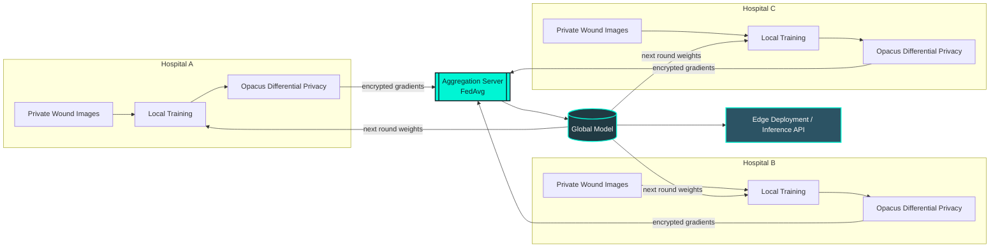

<div align="center">


<br/>

[](#)
[](#)
[](#)
[](#)
[](#)

[](#testing)
[](#security)
[](#security)

</div>

<br/>

## What this is

SecureDerm AI is a federated learning platform that lets multiple hospitals collaboratively train a wound classification model without ever moving patient images off-site. Each hospital trains locally on its own dataset, applies differential privacy noise to the gradients, and only the noised model weights travel to a central aggregator. Raw pixels never leave the hospital network.

The model itself is a ResNet18 backbone fine-tuned to classify ten wound types (abrasions, burns, diabetic wounds, pressure wounds, surgical wounds, and more), with a built-in "unknown, refer to a doctor" fallback for anything it does not recognize confidently.

<br/>

<div align="center">

</div>

## How it flows



No hospital ever sees another hospital's data. Only gradients cross the wire, and those gradients are clipped and noised before they leave the building.

<br/>

## Features

| | |
|---|---|
| **Privacy by design** | Opacus-based differential privacy (configurable epsilon/delta) on every local training round |
| **ResNet18 classifier** | 10-class wound classification with an out-of-distribution "unknown" safety net |
| **FedAvg aggregation** | Weighted federated averaging across an arbitrary number of hospital nodes |
| **Hardened API layer** | Token-gated node registration, signed session tokens, rate-limited auth endpoints |
| **Modern web console** | Next.js dashboard for live training rounds, model marketplace, and hospital directory |
| **Verified email accounts** | Signup requires proving control of the email address before login works |
| **Live wound prediction** | Upload a photo, get a classification with an honest confidence score |
| **Real test coverage** | 54 automated tests across the model, aggregator, and web backend |

<br/>

## Tech stack

<div align="center">

| Layer | Technology |
|---|---|
| Model | PyTorch, TorchVision (ResNet18) |
| Privacy | Opacus (differential privacy) |
| Aggregation server | FastAPI, Uvicorn |
| Hospital node client | Python, Requests |
| Web backend | FastAPI, SQLAlchemy, SQLite |
| Web frontend | Next.js 14, React 18, Tailwind CSS, Framer Motion, Three.js, Recharts |
| Testing | Pytest, HTTPX |

</div>

<br/>

## Quick start

### 1. Set up the Python environment

```bash
python -m venv venv
source venv/bin/activate        # Windows: .\venv\Scripts\Activate.ps1
pip install -r requirements.txt
```

### 2. Start the aggregation server

```bash
python -m aggregator.server
```

### 3. Spin up hospital nodes (separate terminals)

```bash
python -m hospital_node.client --node hospital_A
python -m hospital_node.client --node hospital_B
```

### 4. Configure the web backend (optional, but recommended)

```bash
cp .env.example .env
# fill in JWT_SECRET, and SMTP_* if you want real verification emails.
# See .env.example for what each variable does and its safe defaults.
```

Without a `.env`, the app still runs: sessions get a random per-process
secret (fine for local dev, resets on restart) and verification emails
are logged to the console instead of sent.

### 5. Run the web platform (backend + frontend)

```bash
# Terminal 1: API backend
python -m web_backend.main

# Terminal 2: Next.js dashboard
cd web
npm install
npm run dev
```

### 6. Run the test suite

```bash
pytest -v
```

<br/>

## Project structure

```
securederm-ai/
├── aggregator/            Federated aggregation server (FastAPI + FedAvg)
│   ├── server.py
│   └── fedavg.py
├── hospital_node/         Hospital training client
│   ├── client.py          Register, train, upload
│   ├── train.py           Local training loop
│   ├── dataset_loader.py  Wound image dataset loader
│   └── privacy_layer.py   Differential privacy (Opacus)
├── model/                 Model architecture and inference
│   ├── architecture.py    ResNet18 wound classifier
│   └── inference.py       Shared inference path with OOD detection
├── web_backend/           Hospital-facing API (auth, uploads, training sim)
│   ├── auth.py
│   ├── routers/
│   └── database.py
├── web/                   Next.js dashboard and marketing site
├── config/                Centralized configuration
│   └── settings.py
├── scripts/               Utility and demo scripts
├── tests/                 Automated test suite
└── docs/                  Project documentation
```

<br/>

## Security

<div align="center">

</div>

This project has been through a full security and data integrity audit. What that covered:

- **Sessions**: httpOnly, Secure, SameSite cookies (not localStorage, so a frontend XSS can't just read the token out), signed with a secret generated per-process at boot if none is configured, plus double-submit CSRF protection on every state-changing request
- **Email verification**: a new hospital account can't log in until it proves control of the email address it signed up with (a real, expiring, single-use link); this also closes the door on unreachable/typo'd addresses
- **Passwords**: PBKDF2-HMAC-SHA256 with a self-describing, upgradeable iteration count (600,000 by default, OWASP's 2023 minimum), a common-password blocklist, and a login path that costs the same whether or not the email is registered (no timing-based account enumeration)
- **Federated aggregator**: node identities cannot be hijacked by re-registering an existing hospital ID, model downloads require a valid token, uploaded weight updates are validated against the global model's architecture before aggregation, and request bodies are capped to stop a malformed upload from exhausting server memory
- **Input validation**: email format and password strength are enforced at signup, and uploaded dataset/prediction images are verified to actually be images rather than trusted by their declared content type
- **Database**: SQLite foreign-key enforcement and WAL mode are turned on explicitly (SQLite defaults both off), schema changes run through a small startup migration instead of requiring a hand rebuild of the database file
- **Production posture**: interactive API docs, autoreload, and internal error details are all disabled when `ENV=production`; security headers (CSP, X-Frame-Options, etc.) are set on every response
- **Dependencies**: all known CVEs in the dependency tree have been patched (verified with `pip-audit`)
- **Data hygiene**: test suites run against an isolated database and never touch production data

**Not yet implemented:** Sign in with Google. The schema and endpoints are password-first; OAuth is on the roadmap but needs real Google Cloud credentials to wire up, which only the project owner can create.

<br/>

## Testing

<div align="center">

[](#)

</div>

```bash
pytest -v            # full suite
pytest tests/test_fedavg.py -v      # federated averaging
pytest tests/test_model.py -v       # model architecture
pytest tests/test_server.py -v      # aggregation server
pytest tests/test_web_backend_auth.py -v   # auth, sessions, and email verification
pytest tests/test_predict_router.py -v     # wound prediction endpoint
```

<br/>

<div align="center">


Built for hospitals that want smarter diagnosis without giving up patient privacy.

</div>
